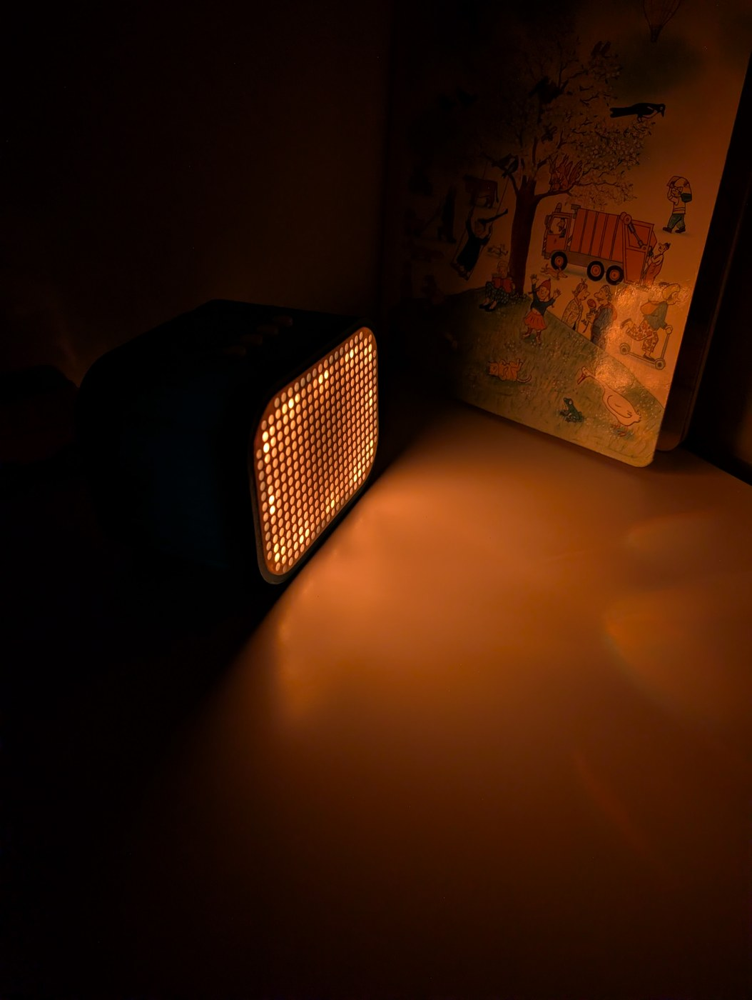
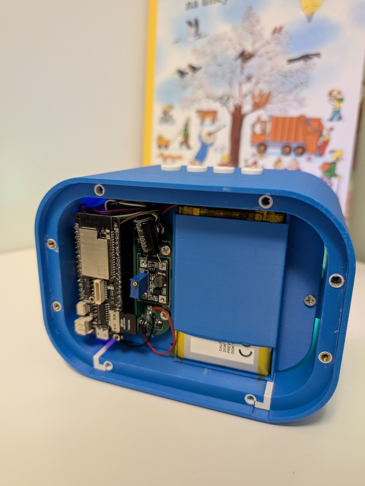
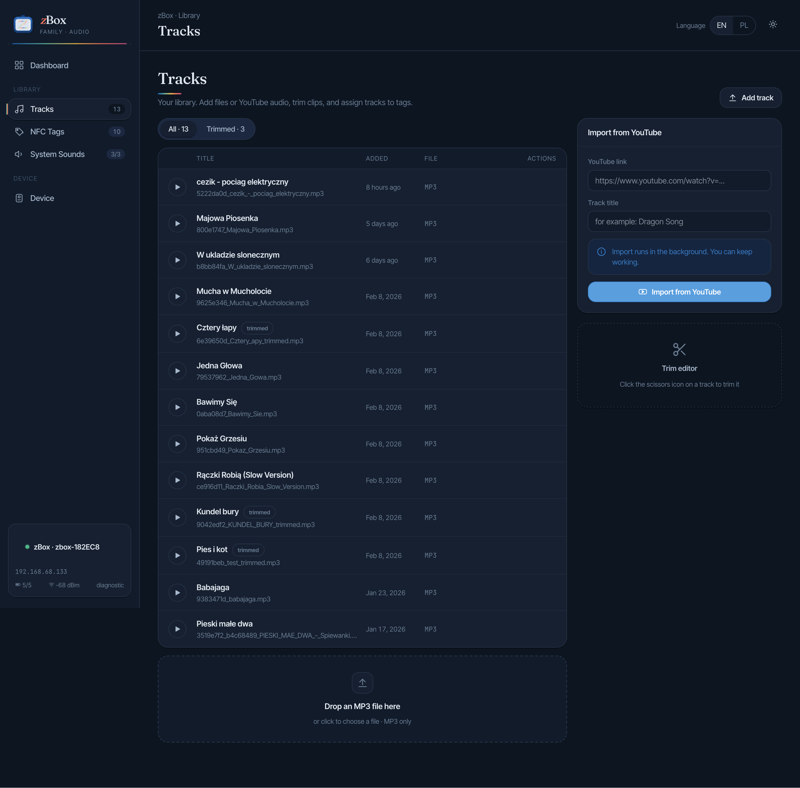
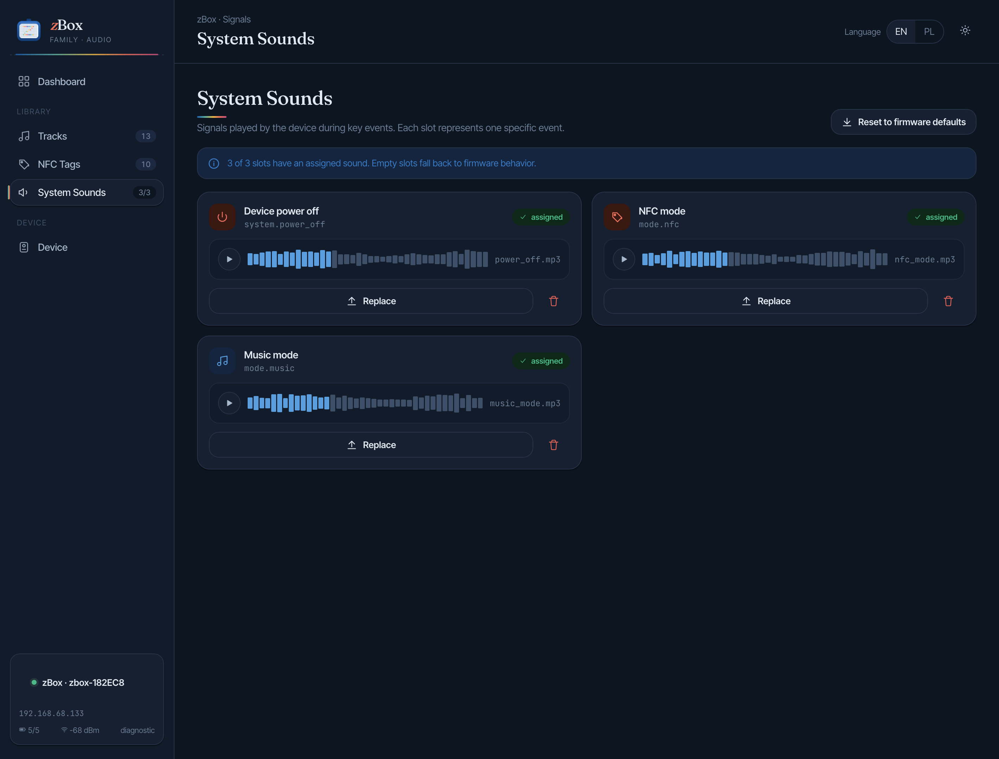

# zBox


zBox is a custom offline NFC audio box I built for my daughter: an ESP32 plays audio from an
SD card when an NFC card is presented, drives a WS2812B light matrix, and is managed from a
small Raspberry Pi-hosted web admin portal. Wi-Fi is used only for sync and maintenance, not
for playback.

This repository is the complete build source — firmware, backend, web admin, KiCad PCB
sources, and docs — so you can rebuild the box or adapt it. It is written to be buildable by
someone who is not an electronics expert: buy the parts, solder them per the schematic, flash,
and use the portal. Mechanical exports (Fusion 360 STEP) live in `hardware/cad/fusion360/step/`.

## Project gallery

<p>
  
  
</p>
<p>
  
  
  
</p>

## Repository layout

```text
.
├── docs/                   Project documentation
├── esp32/                  ESP32 firmware (PlatformIO): playback, NFC, LEDs, audio, sync
├── server/                 FastAPI backend + admin API (SQLite, sync logic)
├── web/                    Static admin portal served by the backend
├── hardware/pcb/kicad/     KiCad schematic and PCB sources
├── hardware/pcb/gerbers/   Manufacturing outputs
├── hardware/cad/fusion360/ Mechanical CAD exports (STEP)
├── assets/photos/          Images used in this README
├── Dockerfile
└── docker-compose.yml
```

## Hardware overview

```text
NFC card ──▶ PN532 reader ──▶ ESP32 Lolin D32 Pro
                                 ├── SD card (local audio + tag mappings)
                                 ├── WS2812B LED matrix
                                 ├── buttons A / B / C / D
                                 ├── I2S ──▶ NS4168 amplifier ──▶ speaker   (default output)
                                 ├── Bluetooth A2DP ──▶ headphones          (optional, on demand)
                                 └── Wi-Fi ── sync / diagnostics only
```

The device is offline-first: audio and mappings live on the SD card. By default sound comes
out of the wired NS4168 amplifier; Bluetooth headphones are an optional mode you switch on
with a button. To save battery, the amplifier, NFC reader, and LED supply are each switched
off in deep sleep by a small transistor.

## What to buy

Practical shopping list for the current board revision. The `PAD_*` items in KiCad are just
solder pads for wires, not parts you buy. If you manufacture the board, treat the KiCad
schematic as the authoritative bill of materials.

**Boards and modules**

- `1x` ESP32 Lolin D32 Pro
- `1x` PN532 NFC module that supports SPI mode
- `1x` NS4168 I2S audio amplifier module
- `1x` speaker driver for the NS4168 output (e.g. reused JBL driver, or any small 4–8 Ω driver that fits your holder)
- `1x` MT3608 step-up module (boosts the battery rail to 5 V for the LEDs)
- `1x` USB-C receptacle `GCT USB4085` or a compatible `USB 2.0 14-pin` footprint match
- `1x` WS2812B LED strip or panel for the front light matrix
- `4x` momentary tactile buttons for `A`, `B`, `C`, `D` — `12 × 12 × 7.3 mm` 4-pin TACT switches with colored caps (e.g. MSALAMON kit or any equivalent)
- `1x` LiPo battery, currently `Akyga LP805080 3.7V / 4000mAh` with `JST 2-pin` connector
  Pack size: `8 mm` thick × `50 mm` wide × `80 mm` high. If you swap it, check the size against the enclosure first.
- Optional: any Bluetooth headphones or speaker for the on-demand BT mode (see [Bluetooth headphones](#bluetooth-headphones-optional))

**Discrete components** (values from the schematic BOM)

- `3x` MOSFET in `SOT-23`: `1x AO3415A` (P, LED supply switch), `1x AO3401A` (P, amplifier switch), `1x AO3400A` (N, NFC switch)
- Resistors: `2x 5.1k`, `3x 10k`, `3x 100k`, `1x 100R`
- Capacitors: `1x 470uF` electrolytic, `2x 10uF` electrolytic, `3x 100nF` ceramic
- hookup wire for all off-board connections

**Non-electronic parts**

- 3D-printed enclosure parts from the project CAD
- speaker holder insert matching your driver
- M3 heat-set inserts and M3/M4 screws (see [Printing the enclosure](#printing-the-enclosure))

## Build cost

What one unit cost me at individual-quantity prices. Buying in bulk lowers the per-unit cost.

| Part | Cost |
|------|------|
| PCB manufacturing | $5 |
| ESP32 Lolin D32 Pro | $15 |
| LiPo battery | $10 |
| Tactile buttons | $1 |
| NS4168 amplifier + speaker driver | ~$3–8 |
| Other components (MOSFETs, resistors, caps, step-up, USB-C) | ~$5–10 |
| Bluetooth headphones / speaker (optional) | — |
| 3D-printed enclosure filament | — |
| **Total (without optional BT device and filament)** | **~$39–49** |

The enclosure design, circuit prototyping, and debugging took far more time than money.

## Audio design notes

The default audio path is a direct digital one: the ESP32 feeds an `NS4168` I2S amplifier over
`GPIO32/33/13`, and the amplifier drives the speaker. This keeps the sound integrated in the
enclosure with no external box.

I first tried a wired `PCM5102A` DAC into a jack, but could not get rid of the noise and
crackle. I also ran an earlier revision that streamed to a `JBL Go 2` over Bluetooth; that
worked but added a whole extra speaker to the mechanical stack. The NS4168 path replaced both.
Bluetooth is still available as an optional [headphones mode](#bluetooth-headphones-optional).

The speaker sits in a holder that slides onto internal rails in the enclosure shell and locks
in place. Swapping it for a different driver just means printing a new holder — no changes to
the main shell.

## Power and sleep

To actually sleep at low current, the board gates power to the heavy peripherals with small
transistors, all default-off at power-on and in deep sleep:

- **NS4168 amplifier** — high-side P-FET on `NS_EN` (`GPIO15`, active LOW), with a soft-start so it does not brown out the 3V3 rail on power-up.
- **PN532 NFC reader** — low-side N-FET on `NFC_EN` (`GPIO12`, active HIGH).
- **LED supply** — the step-up feeding the WS2812B strip is switched on `LED_EN` (`GPIO27`).

Details and the exact circuit are in [`docs/load-switches.md`](docs/load-switches.md) and
[`docs/hardware.md`](docs/hardware.md).

## PCB and schematic

> [!CAUTION]
> The PCB photo in this repository shows an earlier revision. The current schematic already
> includes corrections made after assembling the enclosure. If you are manufacturing a board,
> use the schematic and Gerbers from this repository — not the photo.

- Schematic: [zbox.kicad_sch](hardware/pcb/kicad/zbox.kicad_sch)
- PCB layout: [zbox.kicad_pcb](hardware/pcb/kicad/zbox.kicad_pcb)
- KiCad project: [zbox.kicad_pro](hardware/pcb/kicad/zbox.kicad_pro)
- Manufacturing outputs: [hardware/pcb/gerbers](hardware/pcb/gerbers)
- 3D enclosure export: [zbox_clear.step](hardware/cad/fusion360/step/zbox_clear.step)

Wiring and GPIO pin assignments are documented in [`docs/hardware.md`](docs/hardware.md).

## Printing the enclosure

The STEP model is ready to print. Each part must be printed separately. Orientation matters:

| Part | Orientation |
|------|-------------|
| Shell (main body) | Standing upright on the front face |
| Side wall | Vertical |
| Front cover | No strong preference |
| Rear cover | Lying flat on its inner surface |

### Screws and heat-set inserts

| Location | Insert | Screw |
|----------|--------|-------|
| Rear cover | M3 heat-set inserts | M3 |
| Side wall mounting | — | M4 |
| ESP32 board mounting | — | M4 |

### Build notes

- The buttons are soldered onto a protoboard — there is no custom PCB for them. The build uses **12 × 12 × 7.3 mm momentary tactile switches (TACT, 4-pin)** with colored caps; any equivalent size fits.
- The cutout for the button board in the enclosure is not symmetric. Correct it in Fusion 360, or just account for it when positioning the buttons during soldering.
- The button board is attached to the speaker enclosure with hot glue.

## Hardware disclaimer

I am self-taught in electronics, so the hardware may contain mistakes or weak assumptions I
am not aware of. The current revision works for me in real use, but if you reuse or
manufacture it, review the design carefully rather than trusting it as a reference. In classic
programmer terms: it works on my desk.

## First build walkthrough

From assembled hardware to first playback.

**1. Prepare the SD card.** Format it FAT32. 4–16 GB is plenty. Leave it empty — sync creates
the directory structure on the device automatically.

**2. Flash the firmware.**

```bash
cd esp32
pio run -t upload
```

Before flashing, set `SERVER_HOST` in [`esp32/src/zbox_config.h`](esp32/src/zbox_config.h) to
your server's address (the firmware still needs a compile-time server host). See
[`esp32/README.md`](esp32/README.md).

**3. Start the server.**

```bash
docker compose up -d --build
```

Copy `.env.example` to `.env` and set `ZBOX_IP` to the ESP32's IP address or mDNS hostname so
the portal can reach the device. The portal is then available at `http://<host>:8000`.

**4. Add music and register NFC cards.** See [Adding music and NFC cards](#adding-music-and-nfc-cards).

**5. Sync.** Trigger a sync from the portal with the device on the same Wi-Fi network. LEDs
show yellow while Wi-Fi is active and a blue progress bar while files transfer. After sync,
presenting a registered card in Card Mode starts playback out of the NS4168 speaker — no
Bluetooth pairing needed.

**6. (Optional) Pair Bluetooth headphones.** See [Bluetooth headphones](#bluetooth-headphones-optional).

## Bluetooth headphones (optional)

Playback works out of the wired speaker by default. Bluetooth is an on-demand mode for
listening on headphones (or an external BT speaker):

1. While the box is awake, **hold `A` for ~2 s** to toggle Bluetooth headphones mode. LEDs show soft blue breathing while it connects.
2. The device connects to the configured target — default name `zBox Headphones`. You can scan for and pick a different device from the admin portal's **Device** section.
3. Hold `A` again to switch back to the wired speaker.

The Bluetooth target is stored on the device (NVS). Because the ESP32 does not run Bluetooth
and Wi-Fi at the same time, headphones mode and Sync Mode are mutually exclusive.

## Adding music and NFC cards

The firmware plays **MP3 files only**.

1. **Upload a track.** Open the portal, go to **Songs**, and upload an MP3 (or paste a YouTube URL to import in the background).
2. **Register a card.** Go to **Tags**. Power on the ESP32 and hold an NFC card over the PN532 reader — the portal shows the scanned UID. Name the card and link it to a track. You can also add a card manually by typing its UID.
3. **Sync.** Trigger a sync. The server pushes the updated mappings and audio to the device over Wi-Fi. Presenting the card in Card Mode then plays the assigned track.

## Admin portal

The web admin portal runs at `http://<host>:8000` and manages the device without touching the
firmware.

### Dashboard


Live device status at a glance: connection state, track and tag counts, battery level, system
sounds, and recently added tracks. Tags with no track assigned are flagged here.

### Tracks



The music library. Add tracks by dropping an MP3 or pasting a YouTube URL (downloaded and
converted in the background). A built-in trim editor clips the start/end of a track in the
browser without re-uploading; the trimmed version is what syncs to the SD card.

### NFC Tags

Lists every registered card with its name, UID, and assigned track. The quick-assign panel
maps a card to a track in one click, and you can add a card manually by UID.

**Reading a card UID with an Android phone.** The portal has a built-in scanner using the Web
NFC API — **Chrome on Android only** (on iPhone, enter the UID manually). Open **Tags** in
Chrome, tap **Scan**, and hold the card to the back of the phone; the UID is pre-filled.

Web NFC needs a secure context. If the portal is served over plain HTTP on your LAN, enable
this Chrome flag and add your server address to the allowlist:

```
chrome://flags/#unsafely-treat-insecure-origin-as-secure
```

Alternatively, read the UID with a standalone app (e.g. **NFC Tools** by wakdev) and paste it
into the manual entry field.

### System Sounds



Short clips the device plays for events: power off, switching to Card (NFC) mode, and
switching to Music mode. Each slot shows a waveform preview and can be replaced with a custom
MP3; the reset button restores the firmware defaults.

### Device and sync


The maintenance hub: live connection status, current mode, battery voltage, and SD usage. The
sync button pushes the current library and mappings over Wi-Fi. Below it, a file browser shows
the SD card contents, a log viewer streams device logs without a serial cable, and the
Bluetooth panel lets you scan for and set the headphones target. The connection settings at
the bottom configure the device IP for the portal.

## Getting started (developers)

**Server**

```bash
docker compose up -d --build
```

Runtime data lives in `./data/`, audio in `./music/`, and portal files in `./web/`, all
mounted by `docker-compose.yml`. The only required config variable is `ZBOX_IP` (the ESP32's
IP or mDNS hostname); copy `.env.example` to `.env` and set it before starting.

**ESP32 firmware**

```bash
cd esp32
pio run
pio run -t upload
pio device monitor
```

The firmware depends on `esp32/lib/ESP32-A2DP`, kept as a Git submodule.

## Modes

- **Card Mode.** Default. The device reacts to NFC cards; placing a known card plays its track.
- **Music Mode.** Library playback. NFC is ignored and the buttons control pause / previous / next inside the local library.
- **Light Mode.** Night light, entered from deep sleep by waking with `C` held (see below). `C` and `D` change brightness.
- **Sync Mode.** Service mode used by the admin portal for maintenance, file transfer, logs, and configuration over Wi-Fi.

## Button shortcuts

Buttons `A`–`D` share one decoder; the action depends on the current mode. Long hold is ~2 s
unless noted.

**Waking from deep sleep**

| Buttons | Action |
|---------|--------|
| Hold `D` (~0.4 s, LED fills) | Power on into Card Mode |
| Hold `D` + `C` together | Power on into Light Mode (night light) |

**Card / Music Mode**

| Button(s) | Press | Action |
|-----------|-------|--------|
| `A` | short | Play / Pause |
| `A` | double | Previous track (Music Mode) |
| `A` | long | Toggle Bluetooth headphones on/off |
| `B` | short | Play / Pause |
| `B` | double | Next track (Music Mode) |
| `B` | long | Switch mode: Card ↔ Music |
| `C` | short | Volume − |
| `C` | long | Show battery level |
| `D` | short | Volume + |
| `D` | long, then release | Go to sleep (LEDs blink red at the threshold) |
| `A + B` | long | Enter Sync Mode |

**Light Mode**

| Button | Press | Action |
|--------|-------|--------|
| `C` | short | Brightness − |
| `D` | short | Brightness + |
| `D` | long, then release | Go to sleep |

The device also sleeps on its own after an idle timeout, and forces itself to sleep on
critically low battery.

## LED animations

- **Boot progress.** Blue step-by-step progress; each completed startup stage stays lit and the current one blinks.
- **Connecting Bluetooth.** Soft blue breathing while connecting to headphones (only in the optional BT mode).
- **Idle.** Calm green breathing when ready but not playing.
- **Playing.** Rainbow ring that reacts to audio energy and beats.
- **Night Light.** Solid warm light; brightness set by `C` and `D`.
- **Volume.** Temporary white bar for ~1 s after `Vol +` / `Vol −`.
- **Mode change.** Two short flashes in the mode's color.
- **Sleep ready.** Red blinking once the sleep hold threshold is reached; release to sleep.
- **Sync mode entry.** Purple animated dots while preparing to reboot into Sync Mode.
- **Wi-Fi sync.** Blue blinking while connecting to Wi-Fi, then a blue progress bar while files transfer.
- **Warning.** Slow amber pulse when a mapping or file is missing.
- **Shutdown.** Purple sweep before power-down.
- **Battery check.** Color-coded bar: blue (high) → green → yellow → orange → red (critical).

## Documentation

- [Hardware docs](docs/hardware.md)
- [Load switches / power gating](docs/load-switches.md)
- [Server API and deployment](docs/server.md)
- [ESP32 firmware quick start](esp32/README.md) and [architecture](docs/esp32-firmware.md)

## Known constraints

- Playback is offline-first: files and metadata sync to the SD card instead of streaming during normal use.
- Bluetooth and Wi-Fi are never active at the same time on the ESP32 (memory and radio constraints), so headphones mode and Sync Mode are mutually exclusive.
- The firmware still requires a compile-time server host in `esp32/src/zbox_config.h`.
